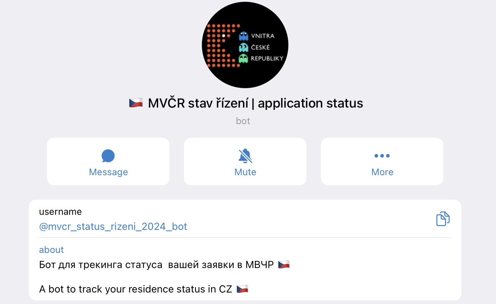

# MVČR Application Status Notifier

A Telegram bot that monitors Czech Ministry of Interior (MVČR) immigration application statuses and notifies you of any changes. Supports both **OAM** (residency applications filed in Czech Republic) and **ŽOV** (visa applications submitted at Czech embassies abroad).

**[Open the bot in Telegram](https://t.me/mvcr_status_rizeni_2024_bot)** - subscribe with your application number and get notified when the status changes.



## Bot Features

- 🔄 **Automated Status Checks**: The bot checks your application status every 60 minutes and sends updates if there are any changes.
- 📌 **Subscription Management**: Start tracking your application with the `/subscribe` command.
- 🔍 **Current Status Check**: Use `/status` to get the current status of your application at any time.
- 🚀 **Force Refresh**: Need an immediate update? Use `/force_refresh` (limited to five uses per day for load management). ⏰
- 🌐 **Language Support**: Change the bot's language with the `/lang` command to suit your preference.
- ❌ **Unsubscribe**: Stop tracking your application using the `/unsubscribe` command.
- ⏰ **Custom Reminders**: Set specific times for reminders using the `/reminder` command for forced updates, ensuring you're informed at the most convenient times.

## Development

### Quick start

```bash
make env          # copy sample env files
make ssl          # generate self-signed certs for RabbitMQ TLS
make test         # run tests
make lint         # run ruff linter
make up           # build and start all services (postgres + rabbitmq + bot + fetcher)
make logs         # tail logs
make help         # list all available targets
```

### Docker Images

| Component | Image | Tag |
|-----------|-------|-----|
| Bot | [`olegeech/mvcr-application-checker`](https://hub.docker.com/r/olegeech/mvcr-application-checker) | `bot-latest`, `bot-v2.4.0` |
| Fetcher | [`olegeech/mvcr-application-checker`](https://hub.docker.com/r/olegeech/mvcr-application-checker) | `fetcher-latest`, `fetcher-v2.4.0` |
| Helm Chart | [`olegeech/mvcr-application-checker-helm`](https://hub.docker.com/r/olegeech/mvcr-application-checker-helm) | `0.3.0` |

### Kubernetes

A Helm chart is available for deploying to Kubernetes:

```bash
helm install mvcr oci://docker.io/olegeech/mvcr-application-checker-helm --version <version>
```

Check [DockerHub](https://hub.docker.com/r/olegeech/mvcr-application-checker-helm/tags) for available chart versions.

The chart deploys all components (bot, fetcher, PostgreSQL, RabbitMQ) with integrated
infrastructure by default. To use an external database/message broker instead, set
`postgresql.enabled=false` and `rabbitmq.enabled=false` with the corresponding
`externalDatabase.*` / `externalRabbitmq.*` values.

See [`deploy/mvcr-application-checker-helm/values.yaml`](deploy/mvcr-application-checker-helm/values.yaml) for all configuration options.

### Architecture

For a deep dive into the system design - components, state machines, message flows, database schema, and more - see [ARCHITECTURE.md](ARCHITECTURE.md).

The project consists of two main services communicating via RabbitMQ:

**Telegram Bot** (`src/bot/`) - handles user interactions, stores subscriptions in PostgreSQL, and periodically queues status check requests.

**Fetcher** (`src/fetcher/`) - consumes requests from RabbitMQ, uses Selenium + Firefox to check application statuses on [ipc.gov.cz](https://ipc.gov.cz), and publishes results back. Supports horizontal scaling with multiple instances.

Both services connect to RabbitMQ over mutual TLS.

## Credits

Big thanks to [Inessa Vasilevskaya](https://github.com/fernflower) for her major contributions to this project.
Thanks to Fedir "Theo" L. (<https://theodorthegreathe.mojeid.cz/>) for providing Ukraine translations.

## Contributing

1. Fork the repository.
2. Create a new branch for your feature or bugfix.
3. Commit your changes with descriptive messages.
4. Submit a pull request for review.
